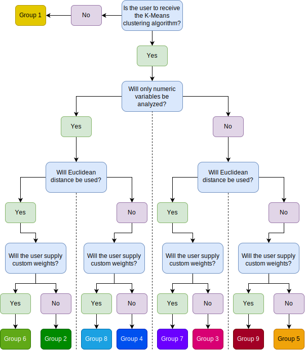

# A Recommendation Algorithm for Spotify Users

This project was my submission to the Grand Valley State University Honors College senior project under mentor Dr. Erin Carrier. All code in the [GitHub repository](https://github.com/ian-curtis/recommender) is licensed under an [MIT license](LICENSE).

Music is one of the rare forms of communication that can be understood on a profound level by anyone; it has the power to cause significant emotional effects, to spark inspiration, to ignite change, to spread knowledge, and more, even regardless of song language. Music’s influence is ever-growing, and its unique powers have become significantly more relevant throughout the COVID-19 pandemic. As communities shut down and governments issued lockdown orders, music played a more significant role for many people wishing to take advantage of their isolation and extra time. Studies in Spain and Israel have demonstrated that, during the pandemic, people have turned to music more than average, whether it be listening to songs, playing an instrument, or watching a livestream (Cabedo-Mas, Ziv). 

With so many people interacting with music, it is natural that many would be searching for new music to listen to. This raises some interesting questions. How do we recommend new music to people? What variables need to be considered in order to provide a good reccommendation? What exactly is a good recommendation and how can we be certain a listener agrees? Can user satisfaction of recommendations improve if a user is given control over how their recommendations are created?

Spotify users may be familiar with current Spotify-provided personalized recommendation systems. One, Discover Weekly provides listeners with new songs they haven't heard before and another, Release Radar, provides recently-released songs that a listeners might enjoy. Both playlists give 30 songs once a week and are the result of a complex algorithm. The exact methods used to construct this algorithm are private to Spotify as are the variables considered in recommendation; therefore, conducting research with Spotify-provided recommendations is difficult. Researchers would have no control over any part of the process and would be unable to manipulate any variables.

While the present algorithm is not as complex nor as effecient as those from Spotify, it does allow researchers to have some freedom in choosing which/how many variables to manipulate. Outside of research, the goals of this program are to provide a new way for users to find new music without having to wait a whole week and to make those recommendations as accurate as possible. In other words, we want to minimize the number of recommended songs that a user did not enjoy and to recommend as many songs as possible that a user will enjoy. A few sub-goals follow: 

* We want to avoid recommending only Top-40 songs (unless this is what *should* be recommended)
* We want to recommend songs that a user does not already have saved in their library
* We want to recommend songs that a user has not heard before (see [Limitations](#limitations) for more on this)

In general, we are interested if, as mentioned above, giving a user some control over how their recommendations are created leads to higher overall satisfaction with those recommendations. 

## Prerequisites

This program is not currently available on the web and is not able to be easily run by an individual user. The app requires an API id and secret, both of which are hidden for security purposes. Should anyone wish to run the app for themselves, they would need to have an installation of Python, a nice text editor (such as Visual Studio Code), and a familiarity with how to use Git/GitHub and run a Python program. They then might create clone this repository by the instructions in the README file and the [code's GitHub repository](https://github.com/ian-curtis/recommender). 

## Data and Permissions Required

In order to run this app, a user must give it permission to access their profile data as well as the songs in their library. The app can only access the information a user permits it too. As such, we have chosen only the permissions necessary for the app to run, ensuring that no excess data is used. This app uses the following scopes (followed by their purpose):

| Scope Name               | Reason                                                                                                                                            |
|--------------------------|---------------------------------------------------------------------------------------------------------------------------------------------------|
| `user-library-read`      | Allows the app to collect songs in a user's library from playlists marked as "public" or "collaborative"                                          |
| `playlist-read-private`  | Allows the app to collect songs in a user's library from playlists marked as "private"                                                            |
| `playlist-modify-public` | Allows the app to create a new playlist, modify the title/description, and add new songs                                                          |
| `user-read-private`      | Allows the app to read private profile data. The app only uses information user country and whether or a not a user can listen to explicit music. |
| `user-top-read`          | Allows the app to read a user's top tracks and top artists                                                                                        |

At the end of the program, all user data and track information is erased. Should a user want more recommendations, they would need to run the app again (those using the algorithm for personal use might comment out the data erasing code). The app does not modify any old playlists, even playlists it has already created, but will instead always create a new one (Spotify playlists can have the same name; each new playlist has a unique identifier allowing for this).

## The Process

The idea behind this project was to provide insight into how different methods of recommendation affect user satisfaction with recommended products. Specifically we explore music recommendation and satisfaction with a recommended playlist and we were interested in how satisfaction of a playlist changes when a user has some control over how the playlist is formed. To investigate this, we created nine different groups, each with a slightly different recommendation process. The first group is a control group where a user is simply assigned 30 random recommendations from a list. The remaining groups rely on a K-Means clustering algorithm and differ in terms of the type of data used to cluster (numeric vs. numeric/ordinal/nominal), the distance metric used (euclidean vs. random other metric), and whether a user is able to contribute to the recommendation process (by rating the importance of certain numeric variables). The K-Means algorithm from the [`pyclustering` package](https://github.com/annoviko/pyclustering) is used as it allows for custom definitions of distance metrics. We chose K-Means due to the unsupervised nature of this project; although we know what songs a user likes, we don't know which songs the user does not like (and we cannot assume they dislike every song not in their library). 

Possible distance metrics currently include manhattan (city-block), euclidean, canberra, chebyshev, minkowski with degree 6, and minkowski with degree 12 with the potential for more to be added. Variables used in clustering are as follows (note that some groups only consider the quantitative variabes while others consider all variables). Variables with an asterisk (*) indicate that variable could be affected by user input.

| Variable Name       | Type | Values     | Brief Description                                                   |
|---------------------|------|------------|---------------------------------------------------------------------|
| `artist_popularity` | num  | 0-100      | Value of the artist's popularity                                    |
| `duration_m`        | num  | 0-?        | Duration of a track in minutes                                      |
| `track_popularity`  | num  | 0-100      | Value of the individual track's popularity                          |
| `danceability`*     | num  | 0-1        | How danceable the track is                                          |
| `energy`*           | num  | 0-1        | How energetic the track is                                          |
| `loudness`          | num  | -60-10?    | How loud a track is (in decibels)                                   |
| `acousticness`*     | num  | 0-1        | How acoustic a track is                                             |
| `instrumentalness`  | num  | 0-1        | How instrumental (without words) a track is                         |
| `liveness`*         | num  | 0-1        | How live a song is (presence of a live audience)                    |
| `tempo`             | num  | 1-240?     | How fast a track is (in beats per minute)                           |
| `valence`*          | num  | 0-1        | How happy/upbeat a track is                                         |
| `half_decade`       | ord  | 1900-2020  | The half-decade a track was released (e.g., 1970, 1975, 1980, etc.) |
| `key`               | ord  | -1-11      | The musical key of the track (-1=None, 0=C, 1=D#, etc.)             |
| `time_sig`          | ord  | 3-7        | Time signature of the track (3/4, 4/4, 5/4, etc.)                   |
| `explicit`          | nom  | True/False | Tells if a track contains explicit content (True) or not (False)    |
| `mode`              | nom  | 0/1        | Whether a track is major (1) or minor (0)                           |

What happens when the program is run mostly depends on random selection. The program is designed to give users a different experience by changing the method by which recommendations are created so when the program is run, the user is assigned to a random group. Regardless of group assignment, all users will go through the following first steps:

1. The program loads all necessary outside packages, connects to the Spotify API (online database from which user data can be accessed), and sets up user information (username, country, and whether they can listen to explicit music).

2. The program reads in all of a user's playlists then asks the user if there are any playlists they would *not* like considered in the recommendation process. For instance, a user may want their holiday playlists excluded from the algorithm.

3. For each playlist to be analyzed, the program collects all of the songs in the playlist and removes the duplicates, creating a master list of all songs a user is known to "like" (or like enough to add to their library).

4. For each song in this list, 30 recommendations are generated from a built-in recommendation algorithm and duplicates are removed. (Note: the algorithm used to generate these recommendations is not known.) This is done because we need a collection of songs from which to recommend. Since we do not have access to every song on Spotify, we believe  potential recommendations is enough to imitate such a list, at least for the purposes of this program. However, it is a parameter in a function so others may decide to use a different value.

It is not necessary to recommend all of the songs in this list (e.g., this could mean recommending over 20,000 songs). Thus the goal is now to determine the best songs out of the list to recommend. 

It is at this point that groups differ. A user will be randomly assigned to one of the following groups (see Figure 1 for a flowchart of the groups):

  1. Given 30 random recommendations from the large list mentioned above (algorithm would end here)
  2. Only the numeric (quantitative) variables are inputted into a KMeans algorithm with euclidean distance
  3. All variables (numeric, ordinal, and nominal) are inputted into a KMeans algorithm with euclidean distance
  4. Only the numeric (quantitative) variables are inputted into a KMeans algorithm with a random distance other than euclidean
  5. All variables (numeric, ordinal, and nominal) are inputted into a KMeans algorithm with a random distance other than euclidean
  6. Only the numeric (quantitative) variables are inputted into a KMeans algorithm with euclidean distance and the user supplies weights
  7. All variables (numeric, ordinal, and nominal) are inputted into a KMeans algorithm with euclidean distance and the user supplies weights
  8. Only the numeric (quantitative) variables are inputted into a KMeans algorithm with a random distance other than euclidean and the user supplies weights
  9. All variables (numeric, ordinal, and nominal) are inputted into a KMeans algorithm with a random distance other than euclidean and the user supplies weights

For groups 4, 5, 8, and 9, the other possible distance metrics are currently manhattan, canberra, chebyshev, minkowski with degree 6 and minkowski with degree 12. In conditions where users give weights, the program prompts them to rate the importance of the numeric variables danceability, valence (happiness), acousticness, liveness, and energy. These weights are then used when standardizing the data. 

Without weights, standardization is done with `scikit-learn`'s `StandardScaler` (for quantitative variables), `OrdinalEncoder` (for ordinal variables), and `OneHotEncoder` (for nominal variables). Users are only asked to provide weights for five numeric variables; thus, only the quantitative standardization is affected. In cases were users provide weights, all scaled values on each of the five rated varialbes are multiplied by the square root of the supplied weight. All outliers are removed before a playlist is created no matter the group. There are typically enough potential recommendations that outlier removal is helpful for the K-Means algorithm.

For all groups except group 1, recommendations are chosen after clustering proportional to the number of saved songs in each cluster. For example, if 28% of songs in a user's library are predicted to be in cluster #2, then 28% of the recommended songs will also come from cluster #2. Final playlists should end up with 30 recommended songs (like the Spotify-provided playlists); however, due to rounding 29 or 31 songs may occur.

## Basic Testing of the Program

It is predicted that group 1 would bring the least user satisfaction and group 7 would bring the most. In general, euclidean distance would outperform other distances, using all variables would outperform just numeric variables, and allowing for user weights would outperform the contrary. Tests were not performed in an experimental setting and therefore cannot be taken too seriously; however, the tests that were done were enough to verify that the program was working as expected.

For basic tests of all groups, five playlists were created:
1. A duplicate of one of my playlists (to emulate a natural playlist "environment")
2. 50 classical pieces
3. 50 pop songs
4. 50 rock songs
5. 50 semi-random, semi-diverse songs

For replication purposes, these playlists are included in `testing.ipynb`. Tests were also run on my own personal library and on playlists from consenting close friends and family. Each person was asked to rate the songs on their final playlists as "Added to a playlist", "Skipped", "Listened to fully, good song", and "Listened to fully, not good song". They were also asked if the track was already in their playlists and if they had already heard the song. A final score was created through the following:

* 1 point was added for adding to a playlist
* 0.5 points were added for listening to the full track and it was a good song
* 0.2 points were added for listening to the full track and it was not a good song
* 1 point was deducted for skipping a track
* 1 point was deducted if the track was already in their playlist
* 0.2 points were deducted if the track had already been heard

The goal was to get a playlist with a score of 30, indicating that each song in the playlist was new to the user and was worth adding to a playlist.

These preliminary tests (n = 5) of groups shows does seem to be in favor of some hypotheses. Of course this must be taken with skepticism as there was no attempt to control for any other factors. One participant in group 3 scored a -2.6 which was higher than the participant assigned to group 2 with a score of -5.9, as predicted. Two were assigned to group 9 with minkowski degree 12 distance and scores were -10.2 and ###. The participant assigned to group 7 scored a ### which goes against the hypotheses. I would be better to see a positive score (meaning more songs enjoyed).

## Limitations

There are certain limitations to this project mostly due to the type of data accessible. DeveloperS using the Spotify API only have access to certain track attributes. Missing notably is song language. We believe that knowing the language of a track provides additional insight into the songs a user enjoys and could help the clustering accuracy; however, this information is not provided by Spotify. 

We also do not have access to a user's listening history (other than the top tracks and top artists). We assume that all songs saved to a user's library are songs they enjoy. While this is a relatively safe assumption, it is surely a conservative estimate of all of the songs they enjoy. It is entirely possible that a user likes a song that they do not choose to add to a playlist. We do not have access to these tracks and must settle with top tracks and saved tracks which may not be truly representative of a user's listening preferences. For example, I have a playlist with 1200 songs from movie soundtracks; even though this is my longest playlist by far it does not mean that I listen to it the most (I don't). Instances like this may skew the clustering and tests on my personal library do show a notable number of recommended soundtracks.

Additionally, all data is taken from the Spotify API meaning that we are trusting the accuracy of Spotify's systems. While is it highly likely that track data is accurate and correct, there is a potential that certain attributes are missing or wrong (for example, a popularity of 0 or a tempo of 0). Some values, such as a loudness of -60 dB, are plausible and correct, but are outliers. Due to the immense amount of recommendations to choose from, we have elected to remove any tracks with any missing data and remove outliers as determined from three outlier-removal algorithms: `IsolationForest`, `LocalOutlierFactor`, and `OneClassSVM`. There is no sure way to detect incorrect data at this time.

In order to recommend songs, we need a list of possible songs to recommend. Then, by analyzing trends in a user's library, we can pick out the best to recommend. Ideally, we would have a list of every possible song on Spotify and pick from there. However, this list is not available to the public. Thus, we claim that by generating 30 recommendations for every 1 saved song (and removing duplicates) we can emulate such a list. It is, however, not known what the recommendation generation algorithm does or how it works.

## Future Work / Potential Applications

The original time allotted for this project (one semester) was not enough to design, run, and complete any full experimental studies. However, the code has the potential to be used in such a setting. The intial inspiration for this project came from questioning the effectiveness of different types of recommendation algorithms. Are consumers more likely to purchase an item if they have control over how their recommendations were created? In other words, can giving consumers direct input into their recommendations help to increase the satisfaction with those recommendations and increase the chances that they purchase a recommended item?

The code here might be used in an attempt to answer questions similar to those by focusing a specific type of recommendation: music. To specify a potential research question, does giving users input into their recommendations lead to higher satisfaction with recommended music quality compared to those who do not get input?

A potential experiment might randomly assign participants to each of the nine groups. With a recommended playlist, participants would rate each track as "liked", "neutral" and "disliked" and researchers could compare the number of tracks "liked" by each participant. Are ratings different for those who had input? Are ratings different between distance metrics (do "better" clusters lead to higher ratings)? To add a semi-supervised learning approach, participants in conditions where they supply weights could also be asked to rate their recommended tracks as "liked" or "disliked" and a new playlist would be created given those responses (this would require extra code).

An experiment of this sort is not in the current scope of the project nor its future; however, others may be inspired to use the code or create something of their own. Nevertheless, there are plans for some future work:

* Incorporate the code into a web application where users can run the app without installing Python (this may involve switching to R and Shiny apps)
* Build in a way to include track genres
* Support data for tracks with more than one artist
* Add in small facts about a user's library and top tracks while they wait for the algorithm to finish (in progress)
* Add more possible distance metrics
* Reduce the time it takes to complete the recommendation process
* Adding more specific comments throughout the code (especially functions) to help guide other developers
* Add error handling mechanisms to avoid unnessecary stopping
* Build in a semi-supervised learning option incorporating user feedback to generate a new playlist
* Improve the code that removes any to-be-recommended songs already in a user's library
  * Currently relies on unique track ids but it is possible for the same track to have a different id, such as Blank Space from Taylor Swift's 1989 and Blank Space from Taylor Swift's 1989 (Deluxe)
* Turn code into a more object-oriented approach

## References
A. Cabedo-Mas, C. Arriaga-Sanz, and L. Moliner-Miravet, “Uses and Perceptions of Music in Times of COVID-19: A Spanish Population Survey,” *Front Psychol*, vol. 11, p. 606180, Jan. 2021, doi: [10.3389/fpsyg.2020.606180](https://doi.org/10.3389/fpsyg.2020.606180).

Novikov, A., 2019. PyClustering: Data Mining Library. Journal of Open Source Software, 4(36), p.1230. Available at: http://dx.doi.org/10.21105/joss.01230.

N. Ziv and R. Hollander-Shabtai, “Music and COVID-19: Changes in uses and emotional reaction to music under stay-at-home restrictions,” Psychology of Music, p. 03057356211003326, Apr. 2021, doi: [10.1177/03057356211003326](https://doi.org/10.1177/03057356211003326).
